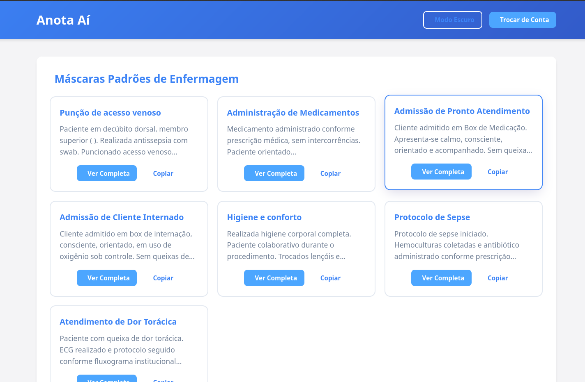

<h1 align="center">📝 Anota Aí</h1>

  Ferramenta simples e direta para salvar anotações rápidas no ambiente hospitalar.  
  Criado para uso pessoal e entre colegas após a remoção da funcionalidade do sistema oficial.

  <a href="https://anotandobp.vercel.app/" target="_blank"><strong>🌐 Acesse o Anota Aí</strong></a>

  🚀 Deploy: <a href="https://vercel.com/">Vercel</a> |  
  🧪 Status: Em Construção & Testando Novas Estruturas |  
  📝 Uso: Interno e Experimental

---

## 🚧 Status do Projeto

> 🏗️ **Em construção e testes**  
> 🔄 Explorando novas estruturas e funcionalidades para melhorar a experiência  
> 💡 Nascido de uma necessidade real no ambiente hospitalar  

---

## 📚 Sobre o Anota Aí

O **Anota Aí** é uma página criada por mim, **Matheus**, técnico de enfermagem e estudante de Engenharia de Software, com foco em **anotações rápidas e acessíveis**.  
Foi pensado para cobrir uma lacuna no dia a dia hospitalar, permitindo que profissionais possam anotar informações sem depender de sistemas oficiais que perderam essa função.

---

## 🚀 Tecnologias Utilizadas

- 🖥️ **HTML5**  
- 🎨 **CSS3** (com design moderno, responsivo e modo escuro)  
- ⚡ **JavaScript** (com localStorage para persistência dos dados, garantindo salvamento automático e recuperação das anotações)  

---

## 📸 Funcionalidades Atuais

- ✅ Área de escrita para anotações rápidas com texto formatado  
- ✅ Botões funcionais: *COPIAR* (com correção para respeitar parágrafos), Salvar, Limpar, Exportar, Apagar Anotações  
- ✅ Armazenamento automático e recuperação das anotações via **localStorage**, definido e testado para garantir persistência entre sessões  
- ✅ Suporte a múltiplas anotações, com aumento do volume e variedade de anotações focadas na área de enfermagem  
- ✅ Visual moderno, limpo, acessível e com **modo noturno (dark mode)** para conforto em plantões noturnos  
- ✅ Layout responsivo adaptado para uso em desktop, tablets e celulares  
- ✅ Feedback visual para ações do usuário (ex: confirmação de salvamento)  

---

## 🎨 Design e Usabilidade

O layout foi aprimorado com:

- Paleta de cores suave, contrastante e com tema escuro opcional, ideal para ambientes hospitalares e longos períodos de uso  
- Tipografia clara, legível e confortável para leitura prolongada  
- Botões grandes, acessíveis e intuitivos para facilitar o uso rápido durante plantões  
- Áreas bem delimitadas para escrita das anotações e lista organizada dos registros salvos  

---

## 🛠️ Próximas Funcionalidades (Roadmap)

- 🔐 **Autenticação simples** para uso seguro e compartilhamento controlado  
- 🗂️ **Categorias e tags** para organizar anotações por setores, temas ou pacientes  
- 📥 **Importação de anotações** para sincronização entre dispositivos  
- 📱 **Aplicativo mobile** com notificações, modo offline e integração com o sistema hospitalar  
- ☁️ **Backup em nuvem** para maior segurança e recuperação de dados  

---

## 🤝 Contribuições

Projeto pessoal e experimental, aberto a sugestões e contribuições para facilitar o uso entre colegas.  
Quer ajudar? Abra uma issue ou envie um pull request!

---

## 🔗 Links Úteis

- 🌐 Site: https://anotandobp.vercel.app/  
- 🧑‍💻 Desenvolvedor: Matheus Miari  
- 📩 Contato: matmiari.eng@gmail.com

---

## Licença

MIT License © 2025 Matheus  
Use livremente, mas mantenha os créditos.
